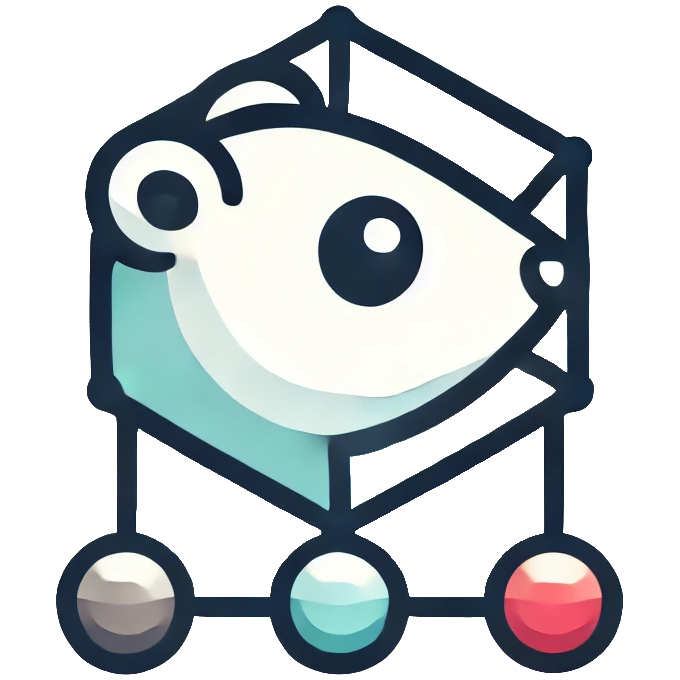

# Gopherate

<div align="center">
    
</div>

Gopherate is a framework for building distributed systems using ZeroMQ. It provides a set of tools and abstractions to create producers, consumers, and brokers that communicate using messages.

## Features

- **Producers and Consumers**: Easily create producers and consumers that can send and receive messages.
- **Broker**: A broker that routes messages between producers and consumers.
- **FSM (Finite State Machine)**: A flexible FSM implementation to manage the state of producers and consumers.
- **Message Handling**: Define and interpret messages with ease.
- **Error and Log Channels**: Centralized error and log handling.

## Installation

To install Gopherate, use `go get`:

```bash
go get github.com/Pigotz/gopherate
```

## Usage

For a complete example, see the E2E tests implemented [here](./test/e2e/flow_test.go).

In case you want to run the standalone Broker, find its implementation [here](./cmd/broker/main.go).

### Broker

```go
ctx := context.Background()

broker, err := broker.NewBroker("tcp://*:5555", nil)

if err != nil {
    panic(err)
}

defer broker.Close()

err = broker.Bind()

if err != nil {
    panic(err)
}

// You should spawn this in a goroutine
// The nil arguments are the error and log channels - see more below
broker.Run(ctx, nil, nil)
```

### Producer

Define the Fibonacci task:

```go
type ComputeFibonacciTask struct {
    steps int
}

func (w *ComputeFibonacciTask) Function() string {
    return "fibonacci"
}

func (w *ComputeFibonacciTask) Args() []string {
    return []string{strconv.Itoa(w.steps)}
}
```

Launch the producer:

```go
ctx := context.Background()

producer, err := producer.NewProducer("producer-ID", "tcp://localhost:5555", nil)

if err != nil {
    panic(err)
}

defer producer.Close()

err = producer.Connect()

if err != nil {
    panic(err)
}

// You should spawn this in a goroutine
// The nil arguments are the error and log channels - see more below
producer.Run(ctx, nil, nil)
```

Submit the Fibonacci task to the network of consumers:

```go
computeFibonacciTask := &ComputeFibonacciTask{
    steps: 100,
}

results, err := producer.Process(ctx, computeFibonacciTask, 5*time.Second)

if err != nil {
    panic(err)
}

// In this specific example, the result is a single string
fmt.Printf("Fibonacci result: %s\n", results[0])
```

### Consumer

The Fibonacci implementation:

```go
func fibonacciHandler(args []string) ([]string, []error) {
    if len(args) != 1 {
        return nil, []error{errors.New("expected 1 argument")}
    }

    steps, err := strconv.Atoi(args[0])

    if err != nil {
        return nil, []error{err}
    }

    a, b := 0, 1

    for i := 0; i < steps; i++ {
        a, b = b, a+b
    }

    return []string{strconv.Itoa(a)}, nil
}
```

The main code:

```go
ctx := context.Background()

consumer, err := consumer.NewConsumer("consumer-ID", "tcp://localhost:5555", nil, consumer.Handlers{
    "fibonacci": fibonacciHandler,
})

if err != nil {
    panic(err)
}

defer consumer.Close()

err = consumer.Connect()

if err != nil {
    panic(err)
}

// You should spawn this in a goroutine
// The nil arguments are the error and log channels - see more below
consumer.Run(ctx, nil, nil)
```

### Error and Log Channels

You can pass error and log channels to the broker, producer, and consumer. This way, you can centralize the error and log handling.

Print functions:

```go
func PrintErrors(ctx context.Context, errors chan error) {
    for ctx.Err() == nil {
        select {
        case <-ctx.Done():
            return
        case err := <-errors:
            fmt.Printf("[%s] [ERROR] %s\n", time.Now().UTC().String(), err)
        }
    }
}

func PrintLogs(ctx context.Context, logs chan string) {
    for ctx.Err() == nil {
        select {
        case <-ctx.Done():
            return
        case log := <-logs:
            fmt.Printf("[%s] [LOG] %s\n", time.Now().UTC().String(), log)
        }
    }
}
```

Passing the channels:

```go
var waitGroup sync.WaitGroup

// Buffer is necessary to prevent blocking
errors := make(chan error, 100)
defer close(errors)

waitGroup.Add(1)
go func() {
    defer waitGroup.Done()

    PrintErrors(ctx, errors)
}()

// Buffer is necessary to prevent blocking
logs := make(chan string, 100)
defer close(logs)

waitGroup.Add(1)
go func() {
    defer waitGroup.Done()

    PrintLogs(ctx, logs)
}()

// broker.Run(ctx, errors, logs)
// producer.Run(ctx, errors, logs)
// consumer.Run(ctx, errors, logs)

waitGroup.Wait()
```

#### Prefixing Errors and Logs

You can prefix the errors and logs with the utility functions you fan find in the `channels` [package](./internal/channels/channels.go).

```go
// Example usage
// `errors` and `logs` have already been defined before

var waitGroup sync.WaitGroup

brokerErrors := make(chan error, 100)
defer close(brokerErrors)

waitGroup.Add(1)
go func() {
    defer waitGroup.Done()

    channels.WrapErrorChannel(ctx, "[BROKER]", brokerErrors, errors)
}()

brokerLogs := make(chan string, 100)
defer close(brokerLogs)

waitGroup.Add(1)
go func() {
    defer waitGroup.Done()

    channels.PrefixStringChannel(ctx, "[BROKER]", brokerLogs, logs)
}()

waitGroup.Add(1)
go func() {
    defer waitGroup.Done()

    broker.Run(ctx, brokerErrors, brokerLogs)
}()

waitGroup.Wait()
```

## Contributing

Pull requests are welcome. For major changes, please open an issue first to discuss what you would like to change.

### Development

To run the tests, use the following command:

```bash
go test ./...
```

## Authors

- **Pigotz** - [Pigotz](https://github.com/Pigotz)

## License

This project is licensed under the MIT License - see the [LICENSE](./LICENSE) file for details.
